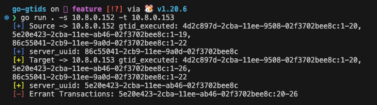
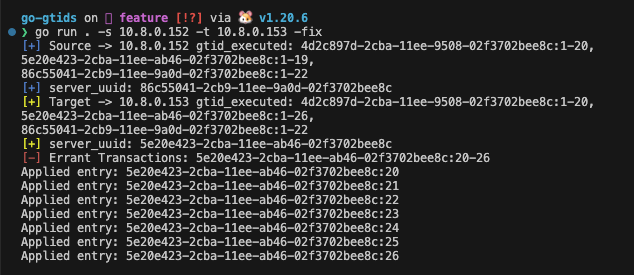

# go-gtids

Check a MySQL source/replica pair for **errant transactions** (GTIDs executed on the
replica that the source never saw) and optionally reconcile them — the GTID-set
comparison equivalent of `pt-slave-restart`-era triage, in a single static binary.

```console
$ go-gtids -s 10.5.0.152 -t 10.5.0.153
[+] Source -> 10.5.0.152 gtid_executed: 1d1fff5a-...:1, c4709bcc-...:1-33
[+] server_uuid: c4709bcc-c9bb-11ed-8d19-02a36d996b94
[+] Target -> 10.5.0.153 gtid_executed: 1d1fff5a-...:1-2, c4709bcc-...:1-33
[+] server_uuid: 1d1fff5a-c9bc-11ed-9c19-02a36d996b94
[-] Errant Transactions: 1d1fff5a-c9bc-11ed-9c19-02a36d996b94:2
[-] Errant Transaction Found in Log Name: binlog.000002
```

Works with MySQL 5.7, 8.0, 8.4, and 9.x (it picks `STOP SLAVE` vs `STOP REPLICA`
and `SHOW MASTER STATUS` vs `SHOW BINARY LOG STATUS` automatically).

## Install

Download a binary from the [releases page](https://github.com/ChaosHour/go-gtids/releases)
(macOS, Linux, Windows; amd64 and arm64), or build from source:

```bash
go install github.com/ChaosHour/go-gtids/cmd/go-gtids@latest
# or
make build            # builds ./bin/go-gtids for the current platform
```

## Usage

```text
go-gtids -s <source> -t <target> [flags]

  -s string              Source host (the primary)
  -t string              Target host (the replica)
  -source-port string    Source MySQL port (default "3306")
  -target-port string    Target MySQL port (default "3306")
  -fix                   Apply errant GTIDs as empty transactions on the SOURCE
  -fix-replica           Apply errant GTIDs as empty transactions on the REPLICA
  -fix-missing-replica   Mark GTIDs missing on the replica as executed (see warning)
  -dry-run               Print the statements a fix would execute without running them
  -yes                   Skip the confirmation prompt before applying fixes
  -version               Print version and exit
  -h                     Print help
```

### Exit codes

| Code | Meaning |
|------|---------|
| 0 | Source and target are in sync (or a fix was applied successfully) |
| 1 | Operational error (connection, query, fix failure) |
| 2 | Errant/missing transactions remain (check mode, dry-run, or fix declined) |

This makes the tool scriptable for monitoring:

```bash
go-gtids -s primary -t replica || alert "GTID drift detected"
```

### Fixing errant transactions

The recommended workflow:

```bash
# 1. See what would happen
go-gtids -s primary -t replica -fix -dry-run

# 2. Apply (prompts for confirmation; -yes skips the prompt for automation)
go-gtids -s primary -t replica -fix -yes
```

`-fix` injects each errant GTID as an **empty transaction on the source**, so the
GTID set converges across the topology. The empty transactions replicate downstream
and are automatically skipped by servers that already executed them. This makes a
future failover safe; **it does not sync data** — if the errant transaction changed
rows, reconcile the data separately (e.g. with
[data-diff](https://github.com/datafold/data-diff)).

All fixes run on a single pinned connection, always reset `GTID_NEXT` afterwards
(even on failure), and replica-side fixes always restart replication (even on
failure or Ctrl-C).

### ⚠️ `-fix-missing-replica`

This flag handles the opposite direction: GTIDs the **source** has that the replica
is missing. It marks them as executed on the replica **without applying their
data** — the source will never resend those transactions. Use it only when you know
the data is already consistent (or will be synced out-of-band); the tool prints a
warning and prompts before proceeding.

## Credentials

Credentials are resolved in this order:

1. `MYSQL_USER` and `MYSQL_PASSWORD` environment variables (both must be set)
2. `~/.my.cnf`:

```ini
[client]
user=root
password=s3cr3t
```

The same credentials are used for both hosts. Connections carry 10s dial and
60s read/write timeouts.

## Development

```bash
make build              # build ./bin/go-gtids
make test               # unit tests (no database needed)
make test-integration   # spins up two MySQL 8.0 containers via docker compose
make test-cover         # unit tests with coverage
```

Integration tests need a `.env` file (gitignored) for docker compose:

```bash
cat > .env << 'EOF'
MYSQL_ROOT_PASSWORD=s3cr3t
MYSQL_DATABASE=chaos2
EOF
```

The compose setup starts `mysql-source` (port 3306) and `mysql-target` (port 3307)
with GTID mode enabled. Test credentials are configurable via `TEST_MYSQL_USER`,
`TEST_MYSQL_PASSWORD`, `TEST_MYSQL_HOST`, and `TEST_MYSQL_PORT` (defaults:
`root` / `s3cr3t` / `127.0.0.1` / `3306`).

To create an errant transaction to play with, write directly to the replica:

```bash
mysql -h 127.0.0.1 -P 3307 -e "CREATE DATABASE oops; DROP DATABASE oops;"
```

CI runs `go vet`, unit tests, golangci-lint, and the integration suite on every
push and pull request.

## Releases

Tagging `v*.*.*` triggers [GoReleaser](https://goreleaser.com/) via GitHub Actions:
binaries for macOS/Linux/Windows (amd64/arm64), archives, SHA256 checksums, and a
changelog. Test locally with `make release-dry-run`.

### Cutting a release, step by step

Work happens on a branch and lands on `main` via a pull request; a version tag
then cuts the release:

```bash
# 1. Branch, commit, push
git checkout -b my-feature
git add -p && git commit -m "feat: describe the change"
git push -u origin my-feature

# 2. Open a pull request (CI runs lint, unit + integration tests, builds)
gh pr create --base main --title "feat: describe the change" \
  --body "What changed and why"

# 3. After the PR merges, tag main to release.
#    Bump MAJOR for breaking CLI changes, MINOR for features, PATCH for fixes.
git checkout main && git pull
git tag v2.0.0
git push origin v2.0.0        # <- this triggers the Release workflow

# 4. Watch it build, then check the release
gh run watch
gh release view v2.0.0
```

The version embedded in the binary comes from the tag automatically
(`go-gtids -version`).

## Screenshots





## Credits

The GTID-set parsing code originates from
[Orchestrator](https://github.com/openark/orchestrator) by Shlomi Noach
(Apache 2.0) — see [CHANGED.md](CHANGED.md) for details.
